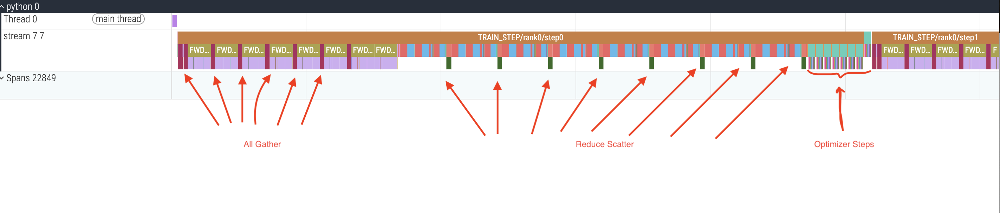
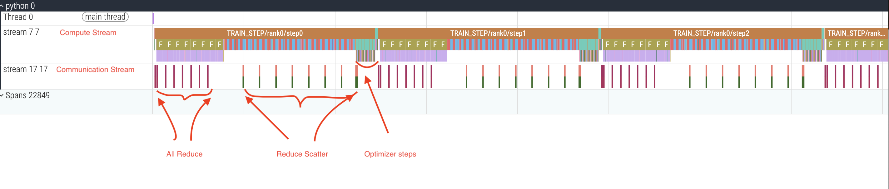

# FSDP with Asynchronous Overlap for Compute and Communication

### **📌 Summary**
This repository explores a custom manual implementation of Fully Sharded Data Parallel (FSDP) with **asynchronous communication overlap**, inspired by **YaFSDP (Yet Another FSDP)**.  
The goal is to validate whether manually controlling **all_gather + reduce_scatter overlap** provides measurable benefits over standard synchronous FSDP execution.

We compare:
- **SYNC Mode** — communication blocks compute (baseline)
- **ASYNC Mode** — communication overlaps with compute via asynchronous collectives and event chaining

---

## **🎯 Motivation**
Traditional FSDP performs:
1. Forward → all_gather full params
2. Backward → reduce_scatter gradients
3. Optimizer step

YaFSDP demonstrated that:
> **Launching all_gather and reduce_scatter asynchronously and overlapping them reduces exposed communication time.**

This repo reimplements the mechanism manually to:
- verify correctness
- visualize overlap explicitly via profiler traces
- understand implementation mechanics deeply
- replicate YaFSDP-style performance plots

**Key techniques used:**
| Feature | Method |
|--------|--------|
| Param rematerialization | All-gather into buffer + *views* (no copies) |
| Async backward overlap | reduce_scatter launched in backward hook |
| Event-driven dependency | Streams + async work handles |
| Two-buffer pool | Double-buffering to pipeline next forward params |

---

## **🧪 Experiment Setup**

### **Hardware**
- 2× NVIDIA GPUs (tested on H100 80Gb)

### **Software**
- PyTorch Distributed + NCCL backend
- Chrome trace export + Perfetto UI

### **Model**
A multi-block custom MLP, each block wrapped in manual FSDP shard logic.

---

## **📂 Execution**

### Disclaimer!
*Works only on GPU. World size (the number of GPUs) is at least 2.*


### Run both experiments:

```python
from fsdp import run_on_cloud
run_on_cloud()
```
Visualize the results by uploading to Perfetto UI.

---

## **📸 Traces (Perfetto UI Screenshots)**

### **🔹 SYNC — Baseline FSDP (No Overlap)**



---

### **🔹 ASYNC — Overlapped FSDP (Manual Implementation)**



---

## **📊 Interpretation**

| Metric | SYNC | ASYNC | Difference |
|--------|------|-------|------------|
| Total Step Time | ~256ms | ~244ms | ~5% faster |


To see meaningful difference, we would need:
- **wider model (more parameters)**
- or **lighter compute kernels**
- or **more GPUs → larger collective latency**

---

## **🧠 Key Takeaways**

✔ Our implementation successfully overlaps RS and AG via hooks  
✔ Memory is efficiently handled using **views** rather than copies  

---

## **📚 Sources & References**
- **YaFSDP**
- PyTorch FSDP RFCs
- DeepSpeed ZeRO Stage-3 implementation notes
- NVIDIA NCCL collective performance docs
